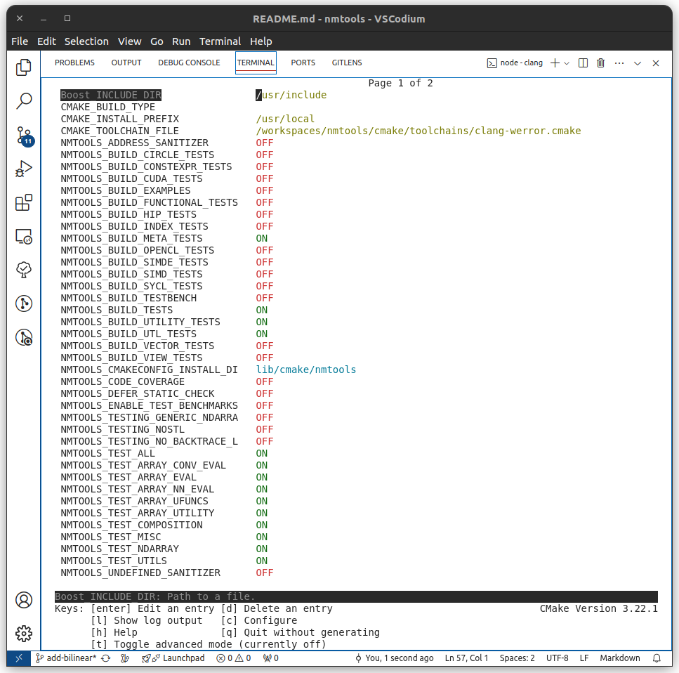

# Development Guide

Cheatsheet for development build and tests.

- [Development Guide](#development-guide)
  - [Basic Building \& Testing (CPU)](#basic-building--testing-cpu)
    - [Build Unit Tests](#build-unit-tests)
    - [Configuring the tests](#configuring-the-tests)
    - [Run Unit Tests](#run-unit-tests)
  - [Build \& Test `web-wasm`](#build--test-web-wasm)
  - [Build \& Test `sycl` OpenMP](#build--test-sycl-openmp)
  - [Build \& Test `sycl` OpenCL](#build--test-sycl-opencl)
  - [Build \& Test `sycl` `cuda`](#build--test-sycl-cuda)
  - [Build \& Test (Ubuntu20.04)](#build--test-ubuntu2004)
  - [Build \& Test `cuda`](#build--test-cuda)
  - [Build \& Test `hip`](#build--test-hip)
  - [Build for arm](#build-for-arm)
  - [Run Interactive Notebook](#run-interactive-notebook)
  - [Run Clang-Repl](#run-clang-repl)
  - [Setup `distcc`](#setup-distcc)
  - [Build with devcontainer](#build-with-devcontainer)
  - [Build \& Test Tilekit](#build--test-tilekit)

## Basic Building & Testing (CPU)

### Build Unit Tests

To build unit tests using gcc:
```
mkdir -p build/gcc
cd build/gcc
cmake ../..
clear && make -j16
```

To build unit tests using clang:
```
mkdir -p build/clang
cd build/clang
cmake -DCMAKE_TOOLCHAIN_FILE=cmake/toolchains/clang-werror.cmake ../..
clear && make -j16
```

### Configuring the tests

To configure the tests interactively:
```
mkdir -p build/gcc
cd build/gcc
ccmake ../..
```
or
```
mkdir -p build/clang
cd build/clang
ccmake -DCMAKE_TOOLCHAIN_FILE=cmake/toolchains/clang-werror.cmake ../..
```

> Tip: install ccmake using `sudo apt install cmake-curses-gui`

A TUI will show up with options available:



After generating, compile the test using:
```
clear && cmake -j16
```

> Warning: Building all the test may takes time and consume huge amount of memory especially on gcc

### Run Unit Tests

After building the tests, run unit tests:
```
ctest
```

## Build & Test `web-wasm`

You can use [dockcross](https://github.com/dockcross/dockcross) wasm image to build and test easily:
```
export IMAGE=web-wasm
docker run --rm dockcross/${IMAGE}:latest > ./dockcross-${IMAGE}; chmod +x ./dockcross-${IMAGE}
./dockcross-${IMAGE} bash -c "emcc -v"
./dockcross-${IMAGE} bash -c "mkdir -p build/${IMAGE} && cd build/${IMAGE} && cmake -DNMTOOLS_TEST_ALL=OFF -DNMTOOLS_TEST_ARRAY_EVAL=ON -DNMTOOLS_TEST_ARRAY_NN_EVAL=ON ../.. && make -j16 VERBOSE=1"
./dockcross-${IMAGE} node build/${IMAGE}/tests/array/numeric-tests-doctest.js
```

## Build & Test `sycl` OpenMP

Targeting OpenMP backend, build dev image and run container:
```
docker build . --tag nmtools:sycl-clang14-omp --target build --file docker/sycl.dockerfile
docker run -it --name sycl-omp-dev --volume ${PWD}:/workspace/nmtools --entrypoint zsh nmtools:sycl-clang14-omp
```
Inside the container, build the tests:
```
mkdir -p build/${TOOLCHAIN} && cd build/${TOOLCHAIN} \
    && cmake -DCMAKE_TOOLCHAIN_FILE=cmake/toolchains/${TOOLCHAIN}.cmake \
        -DNMTOOLS_BUILD_META_TESTS=OFF -DNMTOOLS_BUILD_UTL_TESTS=OFF -DNMTOOLS_TEST_ALL=OFF \
        -DNMTOOLS_BUILD_SYCL_TESTS=ON \
        ../.. \
    && make -j`nproc` VERBOSE=1 numeric-tests-sycl-doctest
```
Then run the test:
```
ctest
```
If there is existing container with name sycl-cuda-dev, you can remove it before build/run:
```
docker rm sycl-omp-dev
```
Or to re-run (after stopping)
```
docker start sycl-omp-dev
docker exec -it sycl-omp-dev zsh
```

## Build & Test `sycl` OpenCL

Targeting OpenCL backend on sycl, build dev image and run container:
```
docker build . --tag nmtools:sycl-clang14-opencl --build-arg opencl_backend=ON --build-arg toolchain=sycl-clang14-generic --target build --file docker/sycl.dockerfile
docker run -it --name sycl-opencl-dev --volume ${PWD}:/workspace/nmtools --entrypoint zsh nmtools:sycl-clang14-opencl
```
Inside the container, build the tests:
```
mkdir -p build/${TOOLCHAIN} && cd build/${TOOLCHAIN} \
    && cmake -DCMAKE_TOOLCHAIN_FILE=cmake/toolchains/${TOOLCHAIN}.cmake \
        -DNMTOOLS_BUILD_META_TESTS=OFF -DNMTOOLS_BUILD_UTL_TESTS=OFF -DNMTOOLS_TEST_ALL=OFF \
        -DNMTOOLS_BUILD_SYCL_TESTS=ON \
        ../.. \
    && make -j`nproc` VERBOSE=1 numeric-tests-sycl-doctest
```
Then run the test:
```
NMTOOLS_SYCL_DEFAULT_DEVICE=opencl ./tests/sycl/numeric-tests-sycl-doctest
```
The env `NMTOOLS_SYCL_DEFAULT_DEVICE` above can be used to select the default device.
If you know the index of the platform you want to use:
```
NMTOOLS_SYCL_DEFAULT_DEVICE_IDX=1 ./tests/sycl/numeric-tests-sycl-doctest
```

If there is existing container with name sycl-cuda-dev, you can remove it before build/run:
```
docker rm sycl-opencl-dev
```
Or to re-run (after stopping)
```
docker start sycl-opencl-dev
docker exec -it sycl-opencl-dev zsh
```
Latest know working version configuration is:
```docker
ENV LLVM_VERSION="18"
ENV LLVM_SPV_VERSION="v18.1.8"
ENV POCL_VERSION="v6.0"
ENV ADAPTIVE_CPP_VERSION="v24.10.0"
```
LLVM version 14 and AdaptiveCPP v23.10.0 is know to be broken, other version not tested.

## Build & Test `sycl` `cuda`
Targeting cuda backend on sycl, build dev image and run container:
```
docker build . --tag nmtools:sycl-cuda-dev --target build --build-arg BASE=nvidia/cuda:11.8.0-devel-ubuntu22.04 --build-arg cuda_backend=ON --build-arg toolchain=sycl-clang14-cuda --file docker/sycl.dockerfile
docker run -it --runtime=nvidia --name sycl-cuda-dev --volume ${PWD}:/workspace/nmtools --entrypoint zsh nmtools:sycl-cuda-dev
```
If there is existing container with name sycl-cuda-dev, you can remove it before build/run:
```
docker rm sycl-cuda-dev
```
Or to re-run (after stopping)
```
docker start sycl-cuda-dev
docker exec -it sycl-cuda-dev zsh
```
Inside the container, build the tests:
```
mkdir -p build/${TOOLCHAIN} && cd build/${TOOLCHAIN} \
    && cmake -DCMAKE_TOOLCHAIN_FILE=cmake/toolchains/${TOOLCHAIN}.cmake \
        -DNMTOOLS_BUILD_META_TESTS=OFF -DNMTOOLS_BUILD_UTL_TESTS=OFF -DNMTOOLS_TEST_ALL=OFF \
        -DNMTOOLS_BUILD_SYCL_TESTS=ON \
        ../.. \
    && make -j`nproc` VERBOSE=1 numeric-tests-sycl-doctest
```

## Build & Test (Ubuntu20.04)

Use ubuntu 20.04 for gcc-9 and clang-10:
```
docker build . --tag nmtools:focal --target build --file docker/focal.dockerfile
docker run -it --name focal-dev --volume ${PWD}:/workspace/nmtools --entrypoint zsh nmtools:focal
```
Inside the container, build the tests:
```
export TOOLCHAIN=clang10-werror
mkdir -p build/${TOOLCHAIN} && cd build/${TOOLCHAIN} \
    && cmake -DCMAKE_TOOLCHAIN_FILE=cmake/toolchains/${TOOLCHAIN}.cmake -DNMTOOLS_TEST_ALL=ON \
        ../.. \
    && make -j`nproc` VERBOSE=1
```
Then run the test:
```
ctest
```

## Build & Test `cuda`

Build the image and run docker container:
```
docker build . --tag nmtools:cuda --target dev --file docker/cuda.dockerfile
docker run -it --runtime=nvidia --name cuda-dev --volume ${PWD}:/workspace/nmtools --entrypoint zsh nmtools:cuda
```

Inside the container, build the tests:
```
# using cuda-clang (`clang -x cuda`)
export TOOLCHAIN=clang
mkdir -p build/cuda-${TOOLCHAIN} && cd build/cuda-${TOOLCHAIN} \
    && cmake -DCMAKE_TOOLCHAIN_FILE=cmake/toolchains/${TOOLCHAIN}.cmake \
        -DNMTOOLS_BUILD_META_TESTS=OFF \
        -DNMTOOLS_BUILD_UTL_TESTS=OFF \
        -DNMTOOLS_TEST_ALL=OFF \
        -DNMTOOLS_BUILD_CUDA_TESTS=ON \
        -DNMTOOLS_TEST_CUDA_PATH=/usr/local/cuda \
        -DNMTOOLS_TEST_CUDA_ARCH=sm_80 \
        ../.. \
    && make -j`nproc` VERBOSE=1
```
```
docker run -it --runtime=nvidia --device /dev/nvidia0 \
  --device /dev/nvidiactl \
  --device /dev/nvidia-uvm \
  --device /dev/nvidia-uvm-tools --name cuda-dev --volume ${PWD}:/workspace/nmtools --entrypoint zsh nmtools:cuda
```
To restart:
```
docker start cuda-dev
docker exec -it cuda-dev zsh
```

## Build & Test `hip`

Build the image and run docker container:
```
docker build . --tag nmtools:hip --target dev --file docker/hip.dockerfile
docker run -it --device /dev/kfd --device /dev/dri --name hip-dev --volume ${PWD}:/workspace/nmtools --entrypoint zsh nmtools:hip
```
Inside the container, build the tests:
```
mkdir -p build/hip && cd build/hip && cmake -DCMAKE_TOOLCHAIN_FILE=../../cmake/toolchains/hip.cmake -DNMTOOLS_BUILD_HIP_TESTS=ON ../.. && make -j`nproc` VERBOSE=1
```
By default, the test use gfx1103 (Ryzen 8700G) as target, you can specify target arch by adding cmake args `-DNMTOOLS_TEST_HIP_ARCH` as follows:
```
mkdir -p build/hip && cd build/hip && cmake -DCMAKE_TOOLCHAIN_FILE=../../cmake/toolchains/hip.cmake -DNMTOOLS_BUILD_HIP_TESTS=ON -DNMTOOLS_TEST_HIP_ARCH="gfx1036,gfx1100,gfx1103" ../.. && make -j`nproc` VERBOSE=1
```
where `gfx1036` is iGPU in ryzen 7000/9000 series and `gfx1100` is for Radeon 7900 XTX.

After successful build, then you can run the hip-test:
```
./tests/hip/numeric-tests-hip-doctest
```


If there is container naming conflict you can remove then re-run, or just restart.
```
docker rm hip-dev
docker run -it --device /dev/kfd --device /dev/dri --name hip-dev --volume ${PWD}:/workspace/nmtools --entrypoint zsh nmtools:hip
```
To restart:
```
docker start hip-dev
docker exec -it hip-dev zsh
```

## Build for arm

```
export IMAGE=linux-arm64
docker run --rm dockcross/${IMAGE}:latest > ./dockcross-${IMAGE}; chmod +x ./dockcross-${IMAGE}
./dockcross-${IMAGE} bash -c "gcc -v"
./dockcross-${IMAGE} bash -c "mkdir -p build/${IMAGE} && cd build/${IMAGE} && cmake -DNMTOOLS_TEST_ALL=ON ../.. && make -j16 VERBOSE=1"
```

## Run Interactive Notebook

This is useful to add/update notebook examples. The notebook is using xeus-cling jupyter kernel to run C++ interactively.

Build the image:
```
docker build -t cling -f ./docker/cling.dockerfile .
```
(Optional) Remove existing if any:
```
docker rm cling
```
Run the image, do not automatically remove since the xeus-cling installation is done in the container not the image.
Starting the container for the first time will install xeus-cling and launch jupyter-lab automatically.
```
docker run -it --network=host -v ${PWD}:/workspace/ --name cling cling
```
If the container is stopped, then you can start it again.
```
docker start cling
docker exec -it cling zsh
```
Inside the docker container, run jupyter-lab:
```
jupyter-lab --allow-root
```

## Run Clang-Repl

Sometimes when you try to build the xeus-cling env it's broken, use clang-repl to run interactively.

Build the image:
```
docker build -t clang-repl -f ./docker/clang-repl.dockerfile .
```
Run
```
docker run -it --name clang-repl -v ${PWD}:/workspace/ clang-repl zsh
```
Then, inside the container, run clang-repl:
```
/opt/llvm-project/build/bin/clang-repl --Xcc="-I/workspace/include/" -Xcc="-Wno-gnu-string-literal-operator-template"
```

To re-run stopped container
```
docker start clang-repl
docker exec -it clang-repl zsh
```

## Setup `distcc`
Build distcc server:
```
docker build --build-arg ubuntu_base=22.04 -t distcc-server -f docker/distcc.dockerfile .
```
Run distcc server (from your build server):
```
docker run -d -p 3632:3632 -p 5201:5201 --name distcc-server1 distcc-server --jobs 24
```
From client machine:
```
mkdir -p build/distcc-clang
cd build/distcc-clang
cmake -DCMAKE_TOOLCHAIN_FILE=cmake/toolchains/distcc-clang.cmake ../..
ccmake ../.. # optional to select which tests to be built
```
build:
```
export DISTCC_VERBOSE=0
export DISTCC_PAUSE_TIME_MSEC=10
export DISTCC_HOSTS="192.168.1.11/24,lzo localhost/32,lzo"
clear && make -j56 VERBOSE=1 all
```

## Build with devcontainer
Build with devcontainer in terminal, useful when trying some version of environment with specific version of compiler.

Install npm if needed:
```
sudo apt install npm
```
Install devcontainer
```
sudo npm install -g @devcontainers/cli
```
power up the container
```
devcontainer --workspace-folder . up
```
run the container
```
devcontainer exec --workspace-folder . zsh
```
A devcontainer.json is provided
```json
    // ...
    // DOCKERFILE: ubuntu focal (for gcc 9)
	"name": "GCC 9",
	"dockerFile": "../docker/focal.dockerfile",
		"args": {
            "USERNAME": "${localEnv:USER}",
        },
        "target": "dev"  
	},

    // DOCKERFILE: ubuntu jammy (22.04)
    // "name": "ubuntu jammy - gcc11, clang14",
	// "dockerFile": "../docker/jammy.dockerfile",

    // DOCKERFILE: ubuntu jammy (22.04)
    // "name": "ubuntu lunar",
	// "dockerFile": "../docker/lunar.dockerfile",
    // ...
```
Build the tests:
```
mkdir -p build/gcc-9
cd build/gcc-9
cmake -DCMAKE_TOOLCHAIN_FILE=cmake/toolchains/gcc-werror.cmake ../..
clear && make -j16
```

## Build & Test Tilekit
Build cpu with `-DNMTOOLS_BUILD_TILEKIT_TESTS=ON`. Automatically built the tilekit tests target with `-O2`

Run tests
```
➜  gcc git:(master) ./tests/tilekit/numeric-tests-tilekit-doctest 
[doctest] doctest version is "2.4.8"
[doctest] run with "--help" for options
Warning, results might be unstable:
* CPU frequency scaling enabled: CPU 0 between 2,982.0 and 5,756.0 MHz
* Turbo is enabled, CPU frequency will fluctuate

Recommendations
* Use 'pyperf system tune' before benchmarking. See https://github.com/psf/pyperf

|               ns/op |                op/s |    err% |     total | benchmark
|--------------------:|--------------------:|--------:|----------:|:----------
|                0.73 |    1,373,717,951.89 |    0.2% |      0.11 | `copy_kernel(4)`
|                0.37 |    2,735,997,350.08 |    0.2% |      0.12 | `copy(4)`
|               14.32 |       69,815,779.88 |    2.3% |      0.12 | `copy_kernel(128)`
|               22.54 |       44,369,202.72 |    0.5% |      0.12 | `copy(128)`
|              462.80 |        2,160,774.27 |    0.1% |      0.12 | `vector_addition_f32x64`
|              922.53 |        1,083,979.11 |    0.1% |      0.12 | `vector_addition_f32x128`
===============================================================================
[doctest] test cases: 7 | 7 passed | 0 failed | 0 skipped
[doctest] assertions: 7 | 7 passed | 0 failed |
[doctest] Status: SUCCESS!
```

Run specific tests with perf
```
➜  gcc git:(master) ✗ sudo perf record ./tests/tilekit/numeric-tests-tilekit-doctest -tc="copy_kernel(128)"
[doctest] doctest version is "2.4.8"
[doctest] run with "--help" for options
Warning, results might be unstable:
* CPU frequency scaling enabled: CPU 0 between 2,982.0 and 5,756.0 MHz
* Turbo is enabled, CPU frequency will fluctuate

Recommendations
* Use 'pyperf system tune' before benchmarking. See https://github.com/psf/pyperf

|               ns/op |                op/s |    err% |          ins/op |          cyc/op |    IPC |         bra/op |   miss% |     total | benchmark
|--------------------:|--------------------:|--------:|----------------:|----------------:|-------:|---------------:|--------:|----------:|:----------
|               14.95 |       66,879,342.56 |    1.3% |          728.00 |           63.79 | 11.412 |         196.00 |    0.0% |      0.12 | `copy_kernel(128)`
===============================================================================
[doctest] test cases: 1 | 1 passed | 0 failed | 6 skipped
[doctest] assertions: 1 | 1 passed | 0 failed |
[doctest] Status: SUCCESS!
[ perf record: Woken up 1 times to write data ]
[ perf record: Captured and wrote 0.035 MB perf.data (480 samples) ]
```

Annotate the report
```
sudo perf report
```
then select function you are intersted,
```
Samples: 501  of event 'cycles:P', 4000 Hz, Event count (approx.): 679195920

   4.84 │ 50:   cmp       %rdx,%rsi
        │     ↓ jae       16d
        │
        │     template <typename m_array_type, typename indices_type>
        │     static constexpr auto get_element(const m_array_type& array, [[maybe_unused]] const indices_type& indices)
        │     {
        │     if constexpr (meta::is_pointer_v<m_array_type>) {
        │     return apply_at(*array,indices);
   6.26 │       vmovss    (%rax,%rsi,4),%xmm0
   6.33 │       cmp       %rdx,%rcx
        │     ↓ jae       180
   5.91 │       vmovss    0x4(%rax,%rsi,4),%xmm2
   6.36 │       cmp       %rdx,%rdi
        │     ↓ jae       17b
   4.89 │       vmovss    0x8(%rax,%rsi,4),%xmm1
   7.43 │       cmp       %rsi,%r10
        │     ↓ je        169
   7.55 │       vinsertps $0x10,0xc(%rax,%rsi,4),%xmm1,%xmm1
   6.32 │       vunpcklps %xmm2,%xmm0,%xmm0
   7.84 │       vmovlhps  %xmm1,%xmm0,%xmm0
        │     }
        │
        │     _GLIBCXX17_CONSTEXPR reference
        │     at(size_type __n)
        │     {
        │     if (__n >= _Nm)
   3.90 │       cmp       $0x80,%rsi
        │     ↓ je        151
        │     auto shape  = nmtools::shape<true>(result);
        │     auto [dim0] = shape;
        │     auto [off0] = offset;
        │
        │     for (nm_size_t j=0; j<dim0; j++) {
        │     at(output,off0*dim0+j) = at(result,j);
   3.94 │       vmovups   %xmm0,(%r9,%rsi,4)
        │     for (nm_size_t i=0; i<n_iter; i++) {
   5.18 │       add       $0x4,%rsi
   9.15 │       add       $0x4,%rdi
   7.40 │       add       $0x4,%rcx
   3.87 │       cmp       %rsi,%r8
        │     ↑ jne       50
        │     auto offset = tuple{i};
        │     auto block  = tk::load(context,array,offset,t_shape);
        │
        │     tk::store(context,out,offset,block);
        │     }
        │     }
   0.20 │       pop       %rbx
   0.61 │       pop       %rbp
        │       pop       %r12
   0.20 │     ← ret
        │       xchg      %ax,%ax
        │ c0:   mov       %rcx,%rbx
        │       shl       $0x4,%rbx
        │       lea       (%rcx,%rcx,1),%rdi
        │       lea       (%rax,%rcx,8),%r11
        │     { return size_type(this->_M_impl._M_finish - this->_M_impl._M_start); }
        │       xor       %esi,%esi
        │     for (nm_size_t i=0; i<n_iter; i++) {
        │       xor       %r10d,%r10d
        │       lea       (%rdi,%rcx,1),%rbp
        │       nop
        │     if (__n >= this->size())
        │ e0:   cmp       %rdx,%rsi
        │     ↓ jae       16d
        │       add       %rcx,%rsi
        │       vmovss    (%rax),%xmm0
        │       cmp       %rdx,%rsi
        │     ↓ jae       16d
        │       vmovss    (%rax,%rcx,4),%xmm2
Press 'h' for help on key bindings
```