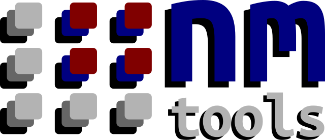
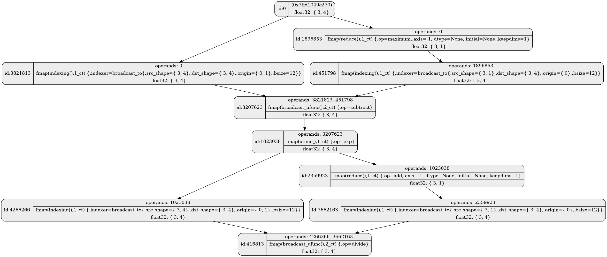
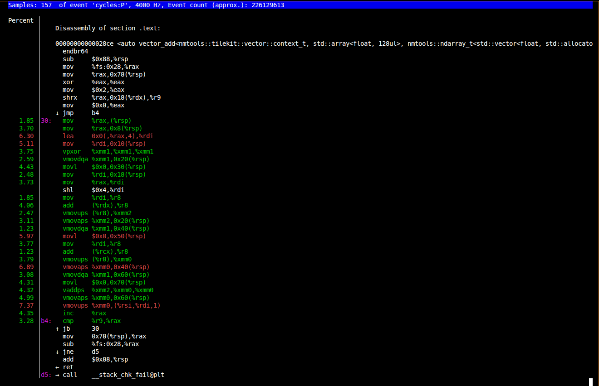

<p align="center">
  
</p>

# nmtools
         [](https://github.com/alifahrri/nmtools/actions/workflows/x86-simd.yml) [](https://github.com/alifahrri/nmtools/actions/workflows/cuda.yml) [](https://github.com/alifahrri/nmtools/actions/workflows/sycl.yml) [](https://github.com/alifahrri/nmtools/actions/workflows/hip.yml) [](https://codecov.io/gh/alifahrri/nmtools)

A generic, composable multidimensional array library.

***(Work In Progress)***

The projects is still work in progress, expect missing docs, features, and benchmarks.

## What is nmtools?

- Array computation library
- Array/Tensor computational graph
- Tile-based kernel embedded DSL

`nmtools` is written in c++ and provide numpy-like array computation in c++. It can also capture the computational graph at compile-time.

### Array Library

```C++
    auto x = nm::array.arange(15, /*dtype=*/nm::float32).reshape(array{3,5});
    auto t1 = (x - x.max(/*axis=*/1,/*dtype=*/nm::None,/*initial=*/nm::None,/*keepdims=*/true)).exp();
    auto t2 = t1.sum(-1,nm::None,nm::None,true);
    auto softmax = t1 / t2;

    print(x);
    print(t1);
    print(t2);
    print(softmax);
```

Sample output:
```
shape: [        3,      5]
[[      0.000000,       1.000000,       2.000000,       3.000000,       4.000000],
[       5.000000,       6.000000,       7.000000,       8.000000,       9.000000],
[       10.000000,      11.000000,      12.000000,      13.000000,      14.000000]]
shape: [        3,      5]
[[      0.018316,       0.049787,       0.135335,       0.367879,       1.000000],
[       0.018316,       0.049787,       0.135335,       0.367879,       1.000000],
[       0.018316,       0.049787,       0.135335,       0.367879,       1.000000]]
shape: [        3,      1]
[[      1.571317],
[       1.571317],
[       1.571317]]
shape: [        3,      5]
[[      0.011656,       0.031685,       0.086129,       0.234122,       0.636409],
[       0.011656,       0.031685,       0.086129,       0.234122,       0.636409],
[       0.011656,       0.031685,       0.086129,       0.234122,       0.636409]]
```

### Computational Graph

```C++
    auto input = nm::random(array{3,4},dtype,gen);

    auto axis = -1;
    auto res = view::softmax(input,axis);

    /* Static computational graph: */
    auto graph = fn::get_computational_graph(res);

    /* Compile-time computational graph: */
    constexpr auto graph_v = nm::to_value_v<decltype(unwrap(graph))>;
```

<!--  -->
<div style="text-align: center;">
  
</div>

### Tilekit

```C++
template <typename context_t, typename out_t, typename a_t, typename b_t>
auto vector_add(context_t& ctx, out_t& out, const a_t& a, const b_t& b)
{
    auto t_shape  = tuple{4_ct};
    auto [dim0]   = t_shape;
    auto a_shape  = shape(a);
    auto [a_dim0] = a_shape;
    auto n_iter   = a_dim0 / dim0;

    for (nm_size_t i=0; i<n_iter; i++) {
        auto offset  = tuple{i};
        auto block_a = tk::load(ctx,a,offset,t_shape);
        auto block_b = tk::load(ctx,b,offset,t_shape);
        auto result  = block_a + block_b;

        tk::store(ctx,out,offset,result);
    }
}
```

<!--  -->
<div style="text-align: center;">
  
</div>

### GPU Support

```C++
    auto gen = nm::random_engine();
    auto dtype = nm::float32;

    auto input = nm::random(array{4096,4},dtype,gen);

    // Change hip to cuda/sycl if using nvidia/neutral
    // auto ctx  = nm::cuda::default_context();
    // auto ctx  = nm::sycl::default_context();
    auto ctx  = nm::hip::default_context();
    auto axis = 1;
    auto gpu_res = nm::tanh(input,ctx);
    auto cpu_res = nm::tanh(input);
```

Sample output:
```
./a.out                                 
[nmtools hip] driver version: 60443484
[nmtools hip] runtime version: 60443484
[nmtools hip] number of hip devices: 1
- compute capability: major: 11 minor: 0
- device name: Radeon RX 7900 XTX
- total mem (bytes): 25753026560
- ecc enabled: 0
- async engine count: 8
- can map to host memory: 1
- can use host pointer for registered memory: 1
- maximum clock (kHz): 2482000
- compute mode: 0
- compute preemption supported: 0
- concurrent kernel execution supported: 1
- coherent access managed memory concurrently with cpu: 1
- cooperative launch supported: 1
- cooperative device launch supported: 1
- caching globals in L1 supported: 1
- host device operation is native atomic: 1
- is integrated GPU: 0
- is multi GPUs: 0
- kernel execution timeout limit: 0
- L2 cache size (bytes): 6291456
- caching locals in L1 supported: 1
- supports allocating managed memory: 1
- maximum block size per multiprocessors: 2
- maximum block size in width (x): 1024
- maximum block size in height (y): 1024
- maximum block size in depth (z): 1024
- maximum grid size in width (x): 2147483647
- maximum grid size in height (y): 65536
- maximum grid size in depth (z): 65536
- maximum threads per block: 1024
- maximum threads per multiprocessor: 2048
- global memory bus width (bits): 384
- maximum memory clock frequency (kHz): 1249000
- multiprocessor count: 48
isclose: true
```

## Requirement
- C++17 (full language features)

Supported compilers:
- gcc 9+
- clang 10+

## Other Examples
- [cmake examples](examples/nmtools/array/README.md)
- [notebook examples](examples/notebooks)
- [stm32 mbed examples](examples/mbed)
- [arduino examples](examples/arduino)
- [android examples](examples/android)