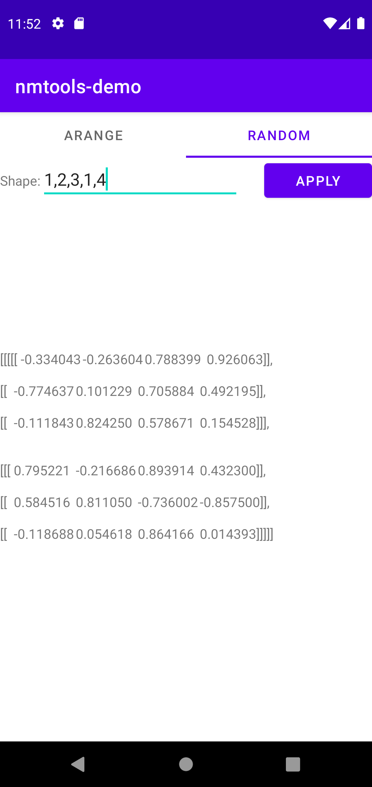
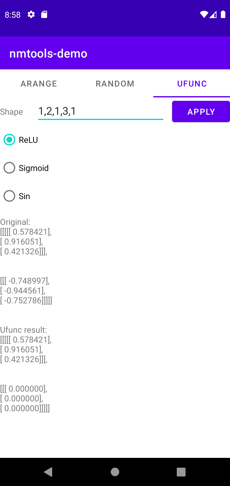
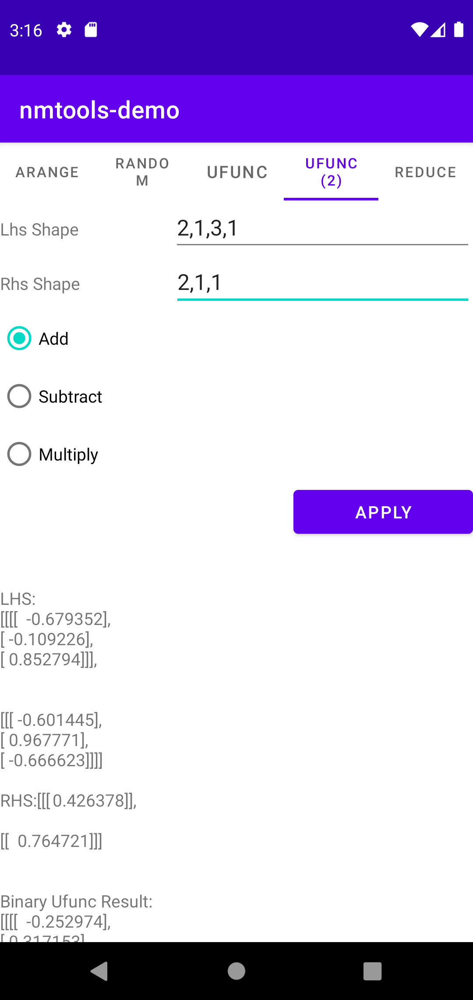
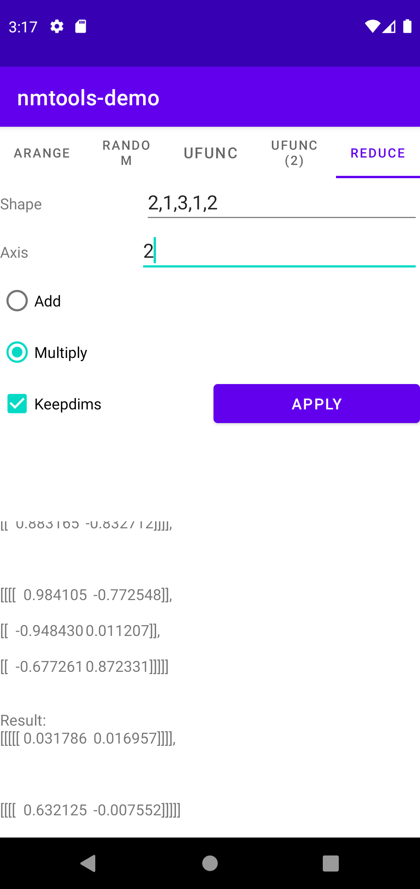

# nmtools Android Example

This example shows how to use nmtools from android.

<p align="left">
  
  
  
  
  
</p>

## Build

Using android studio:
- open projects
- build

You need to install android ndk to build the example.

## Using javac & javap

- use javac to generate JNI header:
    ```
    cd examples/android/nmtoolsdemo/app/src/main/java/com/example/nmtools_demo
    openjdk.javac -h . NmTools.java
    ```
    This will generate `.class` files
- use javap to check java signature to use java class from JNI:
    ```
    cd examples/android/nmtoolsdemo/app/src/main/java/com/example/nmtools_demo
    /snap/openjdk/1241/jdk/bin/javap -s NmTools\$NDArrayFloat.class
    ```
    example result:
    ```
    Compiled from "NmTools.java"
    public class com.example.nmtools_demo.NmTools$NDArrayFloat {
    public com.example.nmtools_demo.NmTools$NDArrayFloat();
        descriptor: ()V

    public com.example.nmtools_demo.NmTools$NDArrayFloat(float[], int[]);
        descriptor: ([F[I)V

    public java.lang.String to_string();
        descriptor: ()Ljava/lang/String;

    public float[] get_data();
        descriptor: ()[F

    public int[] get_shape();
        descriptor: ()[I
    }
    ```