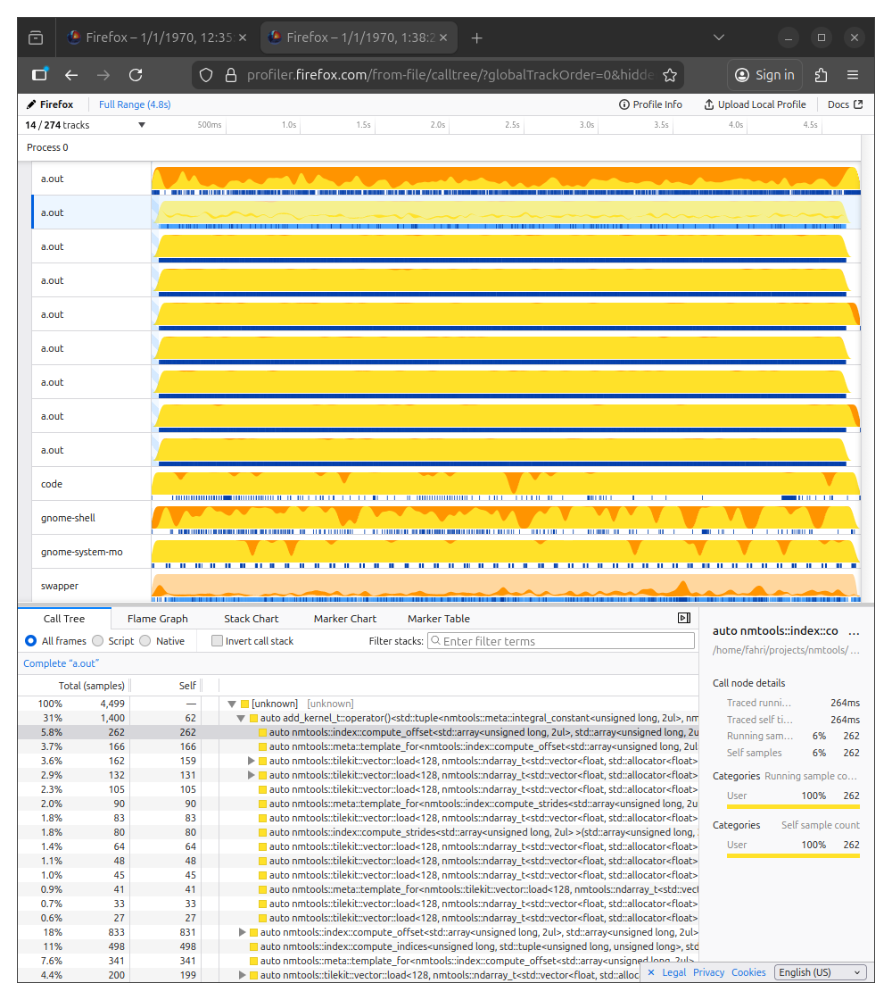
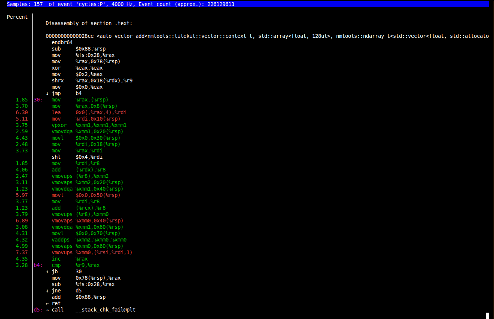

# Tilekit Example

## Basic addition and using perf

Base directory: `perf`

Vector add kernel:
```C++
/* includes */

/* Multicore + SIMD */
using v128_mt = tk::thread_pool<tk::vector::context_t>;

struct add_kernel_t
{
    template <typename tile_shape_t=tuple<nm::ct<2>,nm::ct<4>>, typename context_t, typename out_t, typename a_t, typename b_t>
    auto operator()(context_t ctx, out_t& out, const a_t& a, const b_t& b, const tile_shape_t t_shape=tile_shape_t{})
    {
        auto [t_id] = tk::worker_id(ctx);
        auto [t_size] = tk::worker_size(ctx);

        auto a_shape = shape(a);
        auto offset  = tk::ndoffset(a_shape,t_shape);
        // t_size num workers
        auto n_iter = (offset.size()/t_size);
        for (nm_size_t i=0; i<n_iter; i++) {
            auto tile_offset = offset[(t_id*n_iter)+i];
            auto block_a = tk::load(ctx,a,tile_offset,t_shape);
            auto block_b = tk::load(ctx,b,tile_offset,t_shape);
            auto result  = block_a + block_b;

            tk::store(ctx,out,tile_offset,result);
        }
    }
};
inline auto add_kernel = add_kernel_t{};

int main(int argc, char** argv)
{
    /* setup a,b,c*/

    auto tile_shape  = tuple{2_ct,16_ct};
    auto num_threads = 4;
    auto ctx         = v128_mt(num_threads);
    auto worker_size = num_threads;

    ctx.eval(worker_size,add_kernel,c,a,b,tile_shape);

    /* check or use result */
    
    return 0;
}
```

### Build

To build, simply use g++. You can change the micro-architecture in the `-march` flag, e.g. `-march=native`.
```sh
export NMTOOLS_INCLUDE_DIR=${HOME}/projects/nmtools/include
g++ -std=c++17 -Og -O3 -march=znver5 -I$NMTOOLS_INCLUDE_DIR add.cpp
```

### Run

```sh
./a.out
```

To run it under perf:
```sh
sudo perf record -a -g -F 999 -- ./a.out
```
To visualize the call tree, flame graph along with the timeline view for each threads:
```sh
sudo perf script > out.perf
```
  
As you can see, we have 8 worker threads saturated with works.


To see the assembly hotspot, run the following command then select annotate:
```sh
sudo perf report
```
This is useful to show the actual instruction that's running.  
  
As you can see, the add is vectorized using simd instruction.

## Softmax

Base directory: `softmax`

### Build

```sh
mkdir -p build
cd build
cmake ..
make
```

### Run

```sh
./tilekit-softmax
```

To build with verbose output:
```sh
make VERBOSE=1
```

To build with multiple jobs:
```sh
make -j24 VERBOSE=1
```

### Example Output

```
Warning, results might be unstable:
* CPU frequency scaling enabled: CPU 0 between 2,982.0 and 5,756.0 MHz
* Turbo is enabled, CPU frequency will fluctuate

Recommendations
* Use 'pyperf system tune' before benchmarking. See https://github.com/psf/pyperf

|               ns/op |                op/s |    err% |     total | benchmark
|--------------------:|--------------------:|--------:|----------:|:----------
|           27,112.14 |           36,883.84 |    0.1% |      0.61 | `softmax.4x1024.2x4`
|           25,757.48 |           38,823.67 |    0.1% |      0.61 | `softmax.4x1024.2x8`
|           54,233.71 |           18,438.72 |    0.1% |      0.60 | `softmax.4x1024.2x16`
|           26,854.20 |           37,238.12 |    0.2% |      0.61 | `softmax.4x1024.1x8`
|           31,650.93 |           31,594.64 |    0.1% |      0.61 | `softmax.4x1024.1x16`
|           54,167.49 |           18,461.26 |    0.2% |      0.61 | `softmax.4x1024.1x32`
```